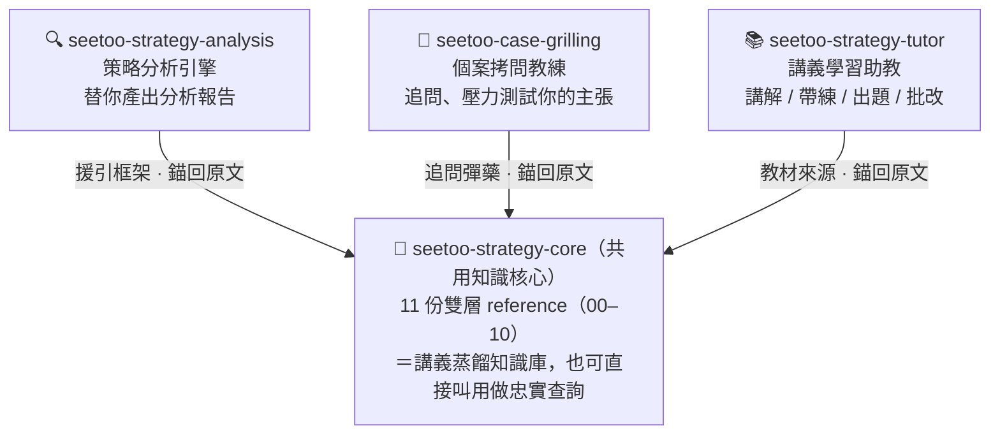
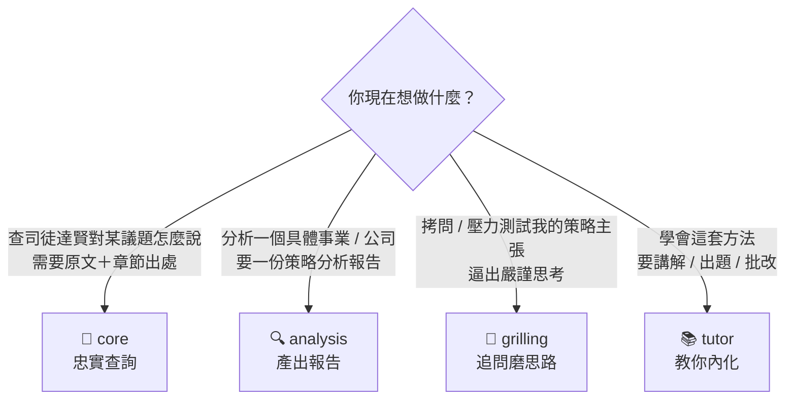

# 司徒達賢策略管理 Skills（Seetoo Strategy Skills）


> 以司徒達賢《策略管理講義》為本，打造一組「非常有紀律與脈絡」的 Claude Code 技能。
>
> A disciplined, source-grounded set of Claude Code skills distilled from
> Prof. Seetoo Dah-Hsian's (司徒達賢) strategic-management lectures.

## 這是什麼

把司徒達賢的策略管理「思維方式」，蒸餾成可被 AI **忠實、有紀律**地運用的技能組。
一切以講義原文為錨——不杜撰、不混入一般 MBA 術語。

**四支技能 = 一個共用知識核心（core）＋ 三支站在核心上的應用技能（analysis／grilling／tutor）。**
三支應用技能各司其職：**core 查原文、analysis 替你分析、grilling 拷問你、tutor 教你學會。**

---

## 架構總覽



- 三支應用技能都**援引（而非重述）** core，並把每個框架主張**錨回講義原文出處**。
- 建造順序：**核心 → 分析 → 拷問 → 學習**（core → analysis → grilling → tutor）。

| 技能 | 角色 | 一句話分工 |
|---|---|---|
| **seetoo-strategy-core** | 共用知識核心（雙層：原文依據 × 操作層） | 查司徒達賢「怎麼說」，附原文＋章節出處 |
| **seetoo-strategy-analysis** | 策略分析引擎 | 用方法**替你產出**一份策略分析報告 |
| **seetoo-case-grilling** | 個案拷問教練 | 用個案教學紀律**拷問你**、磨利思路 |
| **seetoo-strategy-tutor** | 講義學習助教 | **教你學會**：講解 / 帶練 / 出題 / 批改 |

---

## 該用哪一支？



**速查表**（適合情境 × 預期產出 × 例外）：

| 我想… | 用這支 | 它會給我 | 它**不會**做 |
|---|---|---|---|
| 查司徒達賢對某議題怎麼說、要原文＋出處 | **core** | 原文摘錄＋章節頁碼的忠實查詢（帶三標籤） | 不替你分析事業、不教學 |
| 分析一個具體事業、要一份報告 | **analysis** | 三分區報告（六大構面、策略方案、前提驗證） | 不拷問你、不教學、不杜撰事業事實 |
| 被追問、壓力測試我的策略主張 | **grilling** | 蘇格拉底式追問對話＋待驗證前提清單 | 不產出報告、不代你下結論 |
| 學會這套方法、要講解／出題／批改 | **tutor** | 講解、帶練、題目、批改回饋（皆扣回原文） | 不替你分析、不拷問你 |

> 共同邊界（四支都守）：**不杜撰**、**鎖術語**（六大構面用全名「產市垂規地競」）、
> **不從 SWOT／mission-vision／環境分析／設定目標 起手**（守講義第十一章反主張邊界）。

---

## 四支技能詳解

### 1. 📖 seetoo-strategy-core — 共用知識核心

> 司徒達賢《策略管理講義》的蒸餾知識核心（雙層：原文依據 × 操作層）。它有兩個角色：①
> analysis／grilling／tutor 三支技能的**共用底座**；② 可被**直接叫用**做「忠實查詢」，以原文摘錄＋章節出處回答。

- **🎯 使用時機**（觸發語：「查司徒達賢對○○怎麼說」「六大構面」「策略構想」「前提驗證」「策略矩陣／產業矩陣」）
  - 要查司徒達賢對某策略議題的主張，需要**原文摘錄＋章節出處**時。
  - 要忠實運用六大構面（產市垂規地競）、環條目、策略構想、前提驗證、策略矩陣／產業矩陣時。
  - 作為三支技能的底座，被點名讀取某份 reference（如 `05-十步驟程序.md`）時。
- **✅ 適合情境**
  - 對某議題做「忠實查詢」，要原文＋章節出處作答（如：司徒達賢對垂直整合怎麼說）。
  - 要把分析／拷問／教學的框架**錨回講義原文**，避免混入一般 MBA 用語。
  - 要查「何時讀哪份 reference」對照表，定位術語表、六大構面、十步驟、策略矩陣等內容。
- **⚠️ 例外／不適用**
  - 不做三支應用技能本身（各有獨立 spec 與實作）。
  - 不是 MBA 策略百科、不做 PDF 全文重製或 RAG 向量檢索；**只裝講義內容**，以結構化 markdown reference 為準。
  - 講義未涵蓋的議題（例：OKR）會答「**講義未涵蓋**」，不編造。
- **🚧 邊界條件（紀律）**
  - **三標籤檢索**：〔原文〕逐字引述、〔摘述〕忠實轉述、〔延伸·非講義〕外部補充；前兩者必附章節＋頁碼。
  - **原文錨定**：任何操作主張都對應某條原文依據；錨不回 ⇒ 標〔待查〕或不寫。
  - **可回溯**：每份檔在 `章節索引.md` 標來源 PDF 檔／頁，可一鍵回對照。
- **📦 預期產出**
  - 以原文摘錄＋章節出處（章節＋頁碼）回答的忠實查詢結果（帶三標籤）。
  - 「何時讀哪份」reference 地圖／對照表。
  - 每份主題 reference 的雙層結構：原文依據層（附章節頁碼）＋操作層（每條錨回某原文依據編號）。

<details>
<summary><b>📚 core 知識庫：11 份雙層 reference ↔ 講義章節</b>（點開）</summary>

| reference | 主題 | 對應講義 |
|---|---|---|
| `00-術語表` | canonical 術語表 | 重點摘要・第二／三／九章 |
| `01-觀念架構與六大構面` | 觀念架構與六大構面 | 重點摘要・第一／二章 |
| `02-策略構想與前提驗證` | 策略構想與前提驗證 | 第三章 |
| `03-策略方案-構思評估選擇` | 策略方案的構思評估與選擇 | 第四章 |
| `04-功能政策與組織` | 功能政策與組織 | 第五章 |
| `05-十步驟程序` | 策略形態分析法完整程序（SOP） | 第六章 |
| `06-策略矩陣與產業矩陣` | 策略矩陣與產業矩陣 | 第九／十章 |
| `07-道理庫-經濟與產業經濟` | 經濟學與產業經濟學的啟示 | 第七章 |
| `08-道理庫-組織與決策理論` | 組織理論與決策理論的啟示 | 第八章 |
| `09-反主張與方法比較` | 反主張與方法比較 | 第十一章 |
| `10-案例庫` | 鬍鬚張・A 貿易商・B 公司 | 第二／三／四章 |

</details>

---

### 2. 🔍 seetoo-strategy-analysis — 策略分析引擎

> 用司徒達賢策略形態分析法，對一個具體事業／公司產出**有紀律、可回溯**的策略分析報告。
> 它不重述講義，而是把方法**施加到你輸入的事業上**。

- **🎯 使用時機**（觸發語：「分析某公司／事業的策略」「用司徒達賢的方法診斷我的事業」「做策略形態分析」「評估策略選項與前提」「畫策略矩陣」）
  - 要對一個具體事業／公司做策略分析，且希望扣回司徒達賢的方法、有紀律且可回溯時。
  - 要用六大構面逐面描述現行策略形態、釐清策略構想並列出前提時。
  - 要構思並評估多個策略選項（含維持現狀）並驗證關鍵前提時。
- **✅ 適合情境**
  - 對一個具體事業／個案做完整策略分析（預設走十步驟 1–8，可加選配 9／10）。
  - **輸入資訊少**時走「形態速寫」：步驟 1–3＋關鍵前提，缺漏大量標〔待問〕，不靠想像補事實。
  - 需要至少 2–3 個策略方案（含維持現狀），逐方案列出並驗證關鍵前提。
- **⚠️ 例外／不適用**
  - 不是拷問教練——不反問逼你思考（那是 **grilling**）。
  - 不是學習助教——不教學、不出題、不講解（那是 **tutor**）。
  - 不捏造被分析事業的事實；不做一般 MBA 式 SWOT／五力起手分析；不做產業矩陣完整建模（策略矩陣僅速寫）。
- **🚧 邊界條件（紀律）**
  - **兩種不杜撰**：(A) 框架一律錨回 core（附檔名＋章節出處）；(B) 事業事實只用使用者提供的。
  - **三分區**：【事實】（你提供的事業事實）／【框架】（來自 core，附出處）／【判斷】（分析師推論，標〔推測〕）。
  - 缺的事實標〔待問〕；方案 ≥2（含維持現狀），每個方案都要列關鍵前提。
- **📦 預期產出**
  - 一份結構化策略分析報告（【事實】／【框架】／【判斷】三分區）。
  - 現行策略形態（六大構面逐面）＋現行策略構想（構面如何配合、與環條目如何呼應）。
  - 2–3 個策略選項（含維持現狀）＋各方案關鍵前提與真實性評估；建議未來策略形態＋功能政策與組織調整。
  - （選配）策略矩陣速寫：價值單元 × 六大構面的文字矩陣；行動計畫骨架。

---

### 3. 🥊 seetoo-case-grilling — 個案拷問教練

> 化身司徒達賢的**個案教學風格**，對你的事業／策略主張不斷追問、不接受含糊。
> 產物是**被磨利的思路（對話過程本身）**，不是分析報告。所有問題都從司徒達賢的策略概念長出來。

- **🎯 使用時機**（觸發語：「拷問我的策略」「用司徒達賢的方式 challenge 我」「壓力測試這個策略想法」「幫我做個案討論」「我這個策略站得住嗎」）
  - 想拷問／壓力測試自己的事業或策略主張，逼出嚴謹思考時。
  - 想做個案討論、檢驗某個策略想法站不站得住時。
  - 要逼自己分辨「觀察到的事實 vs 推測」、找出策略前提（既存事實 vs 待驗證）時。
- **✅ 適合情境**
  - 帶著一個**具體**的事業／策略主張／個案，想被追問磨利思路（輸出是對話，非報告）。
  - 給出含糊答案（如「運氣好／時機好／我們很努力／團隊很強」），需要被退件、逼出具體做法與前提。
  - 主張需要逐面歸位到六大構面，或某段因果推論（A → B）需要逐步壓力測試。
- **⚠️ 例外／不適用**
  - 不是分析引擎——不替你產出報告、不代你下結論（要報告請用 **analysis**）。
  - 不是學習助教——不教學、不出題、不講解（要學講義請用 **tutor**）。
  - 不替你腦補／編造事業事實（一律用問的）；不羞辱人、不為難而為難。
- **🚧 邊界條件（紀律）**
  - **蘇格拉底式**：以問為主、一次一問或少量追問，逼你自己想；不代答、不長篇說教。
  - **不杜撰（兩面）**：不替你假設事業事實；不杜撰司徒達賢立場（引用主張時錨回 core 並附出處）。
  - **非答案退件**：聽到「運氣好／很努力／團隊很強」即退回，要求講具體做法與前提。
  - **收斂紀律**：前提與因果清楚、或盲點充分暴露即收。
- **📦 預期產出**
  - 被磨利的思路——拷問對話過程本身（不產出分析報告）。
  - 針對每個主張的追問鏈：事實 vs 推測、歸位六大構面、逼出前提、前提反證、因果壓力測試、反主張攔截。
  - 收尾的**一句話摘要**＋**待驗證前提清單**。

---

### 4. 📚 seetoo-strategy-tutor — 講義學習助教

> 帶你**讀懂並內化**策略形態分析法的學習助教，四種模式：**講解 / 帶練 / 出題 / 批改**。
> 全程鼓勵引導、扣回原文，並嚴格區分【講義】（引自 core、附出處）與【教學鷹架】（自加的類比／練習）。

- **🎯 使用時機**（觸發語：「教我司徒達賢的策略」「講解六大構面／策略構想／策略矩陣」「我想學策略形態分析法」「出題考我」「批改我的策略答案」「幫我複習策略管理」）
  - 想學會、讀懂並內化策略形態分析法（入門到內化）時。
  - 要人講解某概念並附原文出處、想被帶著一步步套到例子上練習時。
  - 想被出題考核，或提交自己的答案要被對照方法檢核點批改時。
- **✅ 適合情境**
  - **講解**：解釋一個概念，附 core 原文與章節出處，用白話／類比（標為教學鷹架）幫助理解。
  - **帶練**：帶你一步步把概念套到例子（案例庫的鬍鬚張／A／B、例題習題庫的策略矩陣教學，或你自己的例子）。
  - **出題**：依規準出概念題／應用題／案例題，可直接取用真實講義習題（含 (103) 系列 8 題）。
  - **批改**：對照方法檢核點評分、給具體回饋與訂正方向，並指回 core 出處。
- **⚠️ 例外／不適用**
  - 不替你做完整策略分析（那是 **analysis**）。
  - 不逼問、拷問你既有思路（那是 **grilling**）；需要被拷問時會引導你去用 grilling。
  - 不杜撰講義以外的內容當「司徒達賢說」；超出講義的（如 OKR）只說明「講義未涵蓋」，不延伸。
- **🚧 邊界條件（紀律）**
  - **忠實教學**：只教講義內容，講解附 core 原文＋章節出處。
  - **兩層標示**：【講義】引自 core 並附出處；【教學鷹架】為自加的類比／練習／口訣，明標、不冒充原文。
  - **鼓勵式語氣**：引導、給線索、肯定進步；不像 grilling 那樣連珠炮逼問。
  - **評分檢核點**：用對術語與六大構面、找出並分類前提、分辨事實 vs 待驗證、避免從 SWOT／目標起手、因果是否講清楚。
- **📦 預期產出**
  - 概念講解（含【講義】／【教學鷹架】分層標示）。
  - 帶練過程、題目（概念／應用／案例題，可取用真實講義習題）。
  - 批改回饋（對照檢核點的評分、具體回饋與訂正方向，指回 core 出處）。
  - 建議學習路徑（概念順序，扣回 core 各檔）與各階段學習目標。

---

## 核心紀律（四支技能共同的三條保證）

1. **術語鎖** — 鎖死司徒達賢用詞（見 core `00-術語表`），不替換為一般 MBA 術語；六大構面用全名「產市垂規地競」。
2. **原文錨定** — 每個操作主張都錨回原文；錨不回則標〔待查〕或不寫，**絕不杜撰**。
3. **反主張邊界** — 守講義第十一章主張：**不**從 SWOT／mission-vision／環境分析／設定目標 起手。

---

## 安裝

四支技能透過 symlink 掛到 Claude Code 的 skills 目錄。**請四支一起安裝**——三支應用技能會讀取 core 的 `references/`，預期 core 已安裝在 `~/.claude/skills/seetoo-strategy-core/`。

```bash
git clone https://github.com/jk831224/seetoo-strategy-skills.git
cd seetoo-strategy-skills

# 將四支技能 symlink 到 ~/.claude/skills/
for s in seetoo-strategy-core seetoo-strategy-analysis seetoo-case-grilling seetoo-strategy-tutor; do
  ln -s "$(pwd)/skills/$s" "$HOME/.claude/skills/$s"
done
```

安裝後在 Claude Code 直接用觸發語叫用，例如「**用司徒達賢的方法分析○○的策略**」「**拷問我這個策略想法**」「**講解六大構面並出一題考我**」。
> 用 symlink 的好處是改了 repo 內的技能會即時生效；代價是**這個 repo 目錄不能搬走或改名**，否則 symlink 會斷。

---

## 目前狀態

✅ **v0.1.0（2026-06-20）：四支技能（core／analysis／grilling／tutor）全部完成並合併至 `main`。**

- `seetoo-strategy-core`：11 份雙層 reference（`references/` 00～10）、`SKILL.md`、`章節索引.md`、`版本.md`
  （稽核／索引腳本 `audit_core.py`、`gen_index.py` 位於 repo 根層 `tools/`）；
  逐章 implementer→spec 審→品質審（全 Opus），經最終全案審查（獨立開 PDF 逐字核對）：**0 杜撰、0 待查**。
- `analysis`／`grilling`／`tutor`：各自 `SKILL.md`＋支援檔（範本、提問庫、學習路徑、worked-example 等），均扣回 core、經 Opus 審查判定 READY。
- `tutor` 增強：解析第九章附錄《策略矩陣例題及習題》(`.ppsx`, 387 張) 與第十章附錄《產業矩陣》(`.xls`)，新增 `例題習題庫.md`。

詳見 [`CHANGELOG.md`](CHANGELOG.md)。

---

## 專案結構

```
.
├── skills/                       # 四支技能本體（每支一目錄，含 SKILL.md）
│   ├── seetoo-strategy-core/     #   共用核心：references 00–10、章節索引、版本
│   ├── seetoo-strategy-analysis/
│   ├── seetoo-case-grilling/
│   └── seetoo-strategy-tutor/
├── docs/superpowers/
│   ├── specs/                    # 四支技能的設計規格（spec）
│   └── plans/                    # 四支技能的實作計畫（plan）
├── tools/                        # audit_core.py（稽核）、gen_index.py（生成章節索引）
├── sources/                      # 原始講義 PDF（第三方著作權，不隨本 repo 發佈）
├── README.md
├── CHANGELOG.md
├── LICENSE
└── NOTICE
```

---

## 來源與版權

本專案蒸餾自《司徒達賢策略管理講義》（2024 年版，2025 年 2 月修訂），
原著作權歸 **司徒達賢 教授** 所有。詳見 [`NOTICE`](NOTICE)。

- 本 repo 中標示〔原文〕之逐字引用與〔摘述〕之轉述，著作權仍歸原作者，以註明出處方式引用。
- 原始講義 PDF（`sources/`）**不隨本 repo 發佈**。

## 授權

本專案的**原創部分**（技能架構、操作層、程式碼、文件）採 **MIT License**（見 [`LICENSE`](LICENSE)）。
講義原文引用部分不在 MIT 授權範圍內，著作權歸司徒達賢教授。

## 致謝

策略管理思想：**司徒達賢** 教授。
